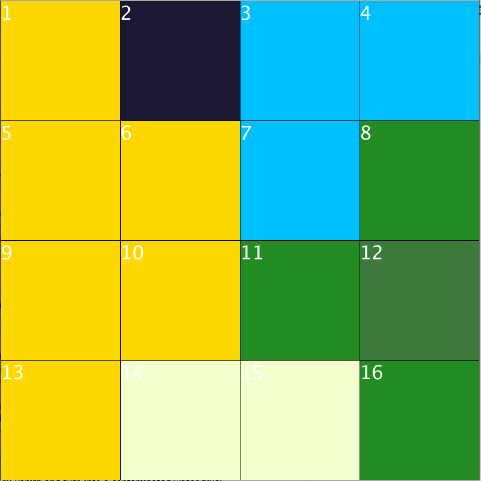

# Deterioration of Air Quality

## Model Description

As technological advances and industrialization have become more prevalent, the human race has produced and consumed more in the past 300 years than it ever did since the beginning of human race till the 18th century. While we are enjoying this rapidly increasing high quality of life, we are becoming used to neglecting the consequences that our behaviours had on the environment.

For years human beings never gave any regards to industrial waste management before dumping it into the environment and kept cutting down the trees, burning down our forests to ashes. When we eventually realized its negative impacts on the air quality overall, it was largely too late.

Therefore, in this cellular automation, I will try to simulate the correlation that the water pollution and deforestation have with the air pollution or the air quality to show you the importance of wastewater treatment, usage of air filtration systems and protecting our forests.

Smog is air pollution that reduces visibility. The term "smog" is used to describe a mix of smoke and fog. The smog usually comes from burning coal, car exhaust, and factory emissions. Photosynthetic organisms such as green plants in forests or algae under the sea, are a big potential for removal of air pollutants. Smog consists of gases like CO2, NO2, SO2 which are important nutrients for these organisms and they absorb them to produce their own food. They reintroduce oxygen into the atmosphere after the conversion and that increases the air quality.

The simulation shows different environmental outcomes depending on how often humans treat their industrial wastewater or sewage, use smoke filters and preserve their woods from deforestation.

## Possible States of Cell

1.  The gold pixels will represent the cities where people live or farmlands, crop fields etc.

2.  The dark green pixels will represent the lush beautiful forests.

3.  The greenish white pixels will represent the deserts where barely any plant lives or destroyed forests.

4.  The deep sky blue pixels will represent the clean seas or oceans where algae is abundant.

5.  The dark purple pixels will represent the contaminated waters where algae were all killed and dead.

6.  The gray translucent pixels will represent the smog (smokes of CO2, NO2, SO2) that reduce the air quality.

## Evolution Rules

1.  In the beginning of the simulation, the cities will always pop up in the middle of deserts.

2.  Whenever a city pixel is adjacent to one or more desert pixels, there is a 50% chance that one of the relevant desert pixels will turn into a city pixel, and others will stay the same, in every frame. (This is how the cities will grow over time.)

3.  Whenever a city pixel interacts with one or more forest pixels, there is a p% chance that one of the relevant forest pixels will vanish and turn into a desert pixel. (This is deforestation), where p is given by the formula (100/(100-deforestationAwarenessRate+1))%

*\*The variable deforestationAwarenessRate represents how much humans pay attention not to damage their forests, in percentages.*

4.  Whenever a city pixel interacts with one or more water pixels, there is a 0.1% chance that one of the relevant water pixels will vanish and turn into a contaminated water pixel. (Beginning of Water Pollution)

5.  Whenever a contaminated water pixel interacts with one or more water pixels. There is a (100/(100-waterPollutionAwarenessRate+1))% chance that one of the relevant water pixels will vanish and turn into a contaminated water pixel. (Spread of Water Pollution in Seas)

*\*The variable waterPollutionAwarenessRate represents how much humans give regards to waste management and treat their wastewater or sewage before dumping it into the oceans, in percentages.*

6.  Whenever a forest pixel interacts with a contaminated water pixel. There is a 0.1% chance that the relevant forest pixel will vanish and turn into a desert pixel. (Because water pollution negatively affects the plants nearby as well)

7.  In every frame, there is a (100/(100-airPollutionAwarenessRate+1))% chance that any city pixel will create a new dark grey translucent smog pixel above it. (Source of air pollution)

*\*The variable airPollutionAwarenessRate represents how much humans pay attention not to emit detrimental gases into the air or use smoke filters and such, in percentages.*

8.  Whenever a smog pixel interacts with a water or a forest pixel. There is a 50% chance that the smog pixel will disappear and will be cleaned. (The photosynthetic organisms living in forests and under the water will absorb those gases and release oxygen, increasing the air quality accordingly.)

9.  The smog pixels will not be affected by the contaminated water or desert pixels. Because contaminated water killed every living being under it and there are barely any plants in deserts.

10. Whenever a water pixel interacts with one or more contaminated water pixels. There is a 0.02% chance that one of the relevant contaminated water pixels will be cleaned and turned into a water pixel. Similarly, whenever a forest pixel interacts with one or more desert pixels. There is a 0.02% chance that one of the relevant desert pixels will turn into a water pixel and new plants will grow in that area. (We all know that nature eventually heals itself when we leave it alone, either by reproduction of new plants or by decomposition of our waste in nature. But it is unfortunately a very slow process.)

## Sample Evolution

| First Generation | Second Generation |
|:---:|:---:|
|  |  |

## The Cells that Changed State

- Cell 3: Evolution Rule \#5 (Caused by Cell 2)

- Cell 7: Evolution Rule \#4 (Caused by Cell 6)

- Cell 11: Evolution Rule \#3 (Caused by Cell 11)

- Cell 12: Evolution Rule \#8 (Caused by Cell 12)

- Cell 14: Evolution Rule \#2 (Caused by Cell 13)

## Accurate Predictions Made by the Model

1.  This simulation shows how water pollution and deforestation can deteriorate the air quality and how protecting them helps us get rid of such harmful gases in the atmosphere, just like in real life.

2.  The simulation also accurately predicts that the precautions we take in order to protect our environment can significantly slow down the destruction of our environment we usually take for granted.

3.  The simulation also predicts that no matter how much you try to protect the environment, you will still use up resources to feed your population because, the more the population grows, the more the societies will consume. However we can decrease that a lot by recycling.

4.  And lastly, the simulation also accurately portrays that the more humans realize they are running out of resources, the more cautious they will be when consuming any more. You can understand what I mean by assigning all the awareness rates to 0% in the code and start running the simulation. The cities will grow rapidly and humans will cut down the forests at a frantic speed but eventually the deforestation will get slower as the time goes on.

## What the Model Gets Wrong About the Reality

1.  This simulation assumes that photosynthetic organisms absorb carbon dioxide and release oxygen all the time. However, in reality this process is actually the other way around. The cellular respiration happens at nights rather than photosynthesis. Photosynthesis happens during the daytime.

2.  The weather is always sunny everywhere in this simulation. It never rains or snows and all. Whereas in reality, there are many types of weather obviously.

3.  This program assumes that cities grow all the time and never stops growing. But in reality we know that this isn’t always the case. For example, the human population may diminish because of wars or the birth rate might be too low.

4.  This simulation assumes that the gas particles causing the air pollution only consists of carbon dioxide, sulphur dioxide and nitrogen dioxide molecules which the photosynthetic organisms can absorb. Whereas in reality, air pollution is caused by various other harmful gases such as chlorofluorocarbons, VOCs and other chemical pollutants which photosynthetic organisms cannot really deal with.
